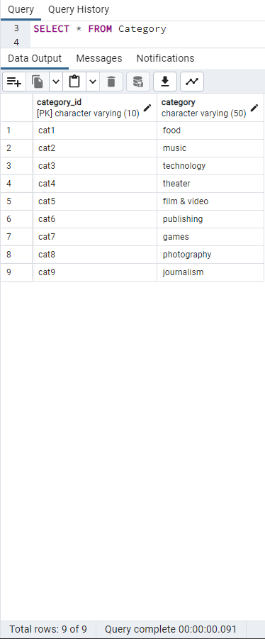
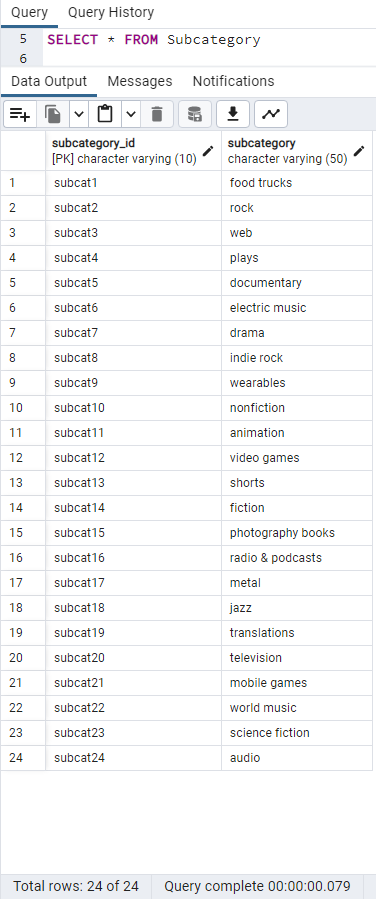
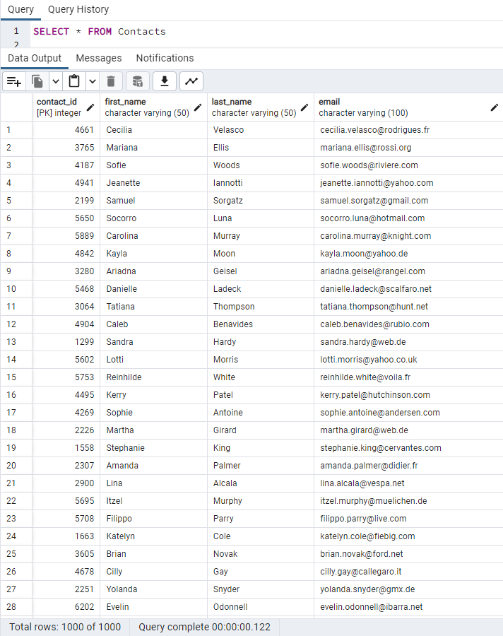
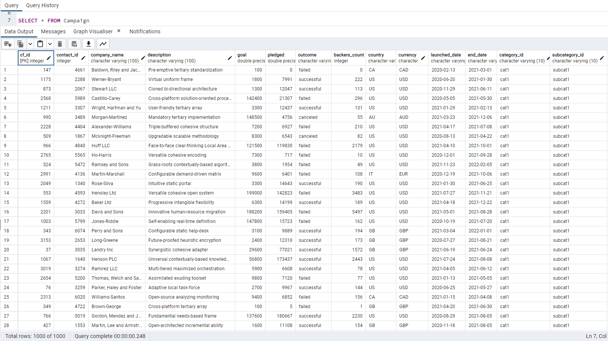
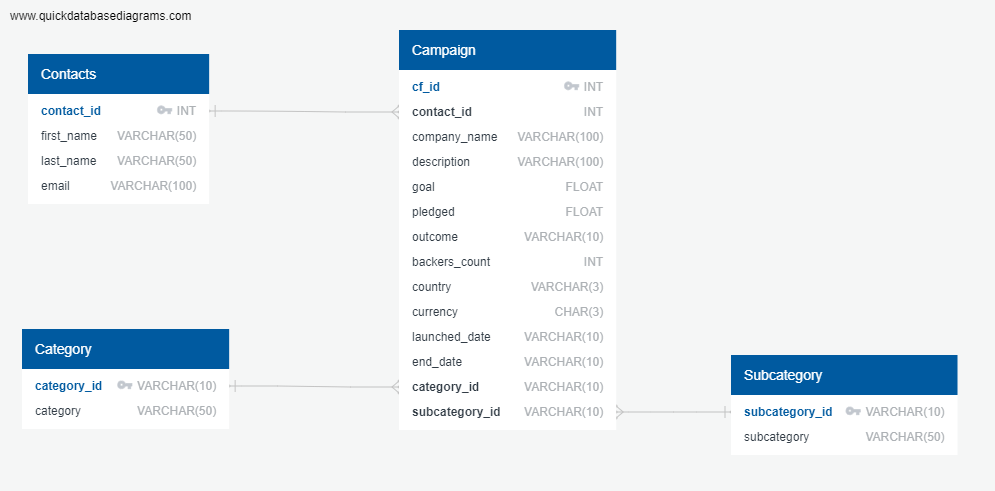

# Project – 2: ETL Crowdfunding

## Overview

A team exercise to build an ETL pipeline using Python, Pandas, and either Python dictionary methods or regular expressions to extract and transform the crowdfunding data. After the transformation, four CSV files are created and create an ERD and a table schema based o CSV files. 

## Background

In this project, we practiced building an ETL pipeline to process crowdfunding data from Excel files. The data was extracted and transformed to, create four CSV files, and then used the CSV files to create an Entity Relationship Diagram (ERD) and a table schema. Finally, the CSV files were loaded into a PostgreSQL database.

## Source of data

 - contacts.xlsx
 - crowdfunding.xlsx

## Resources Used

 - Python
 - Pandas
 - PostgreSQL
 - Jupyter Notebook
 - QuickDBD
 - Excel

## Steps involved

This  mini project was divided into the following subsections:

 - Create the Category and Subcategory DataFrames: Our team members Hicham Bentahila and Arefin Shamsil successfully created the Category and Subcategory DataFrames respectively with the category.csv and subcategory.csv as output files.
 - Create the Campaign DataFrame: Our team member Arun Balaram successfully created the Campaign DataFrame with the campaign.csv as output file
 - Create the Contacts DataFrame: Our team member Shelly successfully created the Contacts DataFrames with the contacts.csv as output file
 - Create the Crowdfunding Database: Our team collectively worked on crowdfunding database to establish and present the Entity Relationship Diagram (ERD) using Quick DBD (https://www.quickdatabasediagrams.com/)
- We successfully created the database tables and imported the csv files using the PostgreSQL.

## Snapshots of database file:

Category database

 
Subcategory database

 
Contacts database

 
campaign database

 
## The Entity Relationship Diagram:

- **contact\_id** is the primary key in contact dataframe and has **one to many** relationship with the campaign dataframe.
- **catedory\_id** is the primary key in category dataframe and has **one to many** relationship with the campaign dataframe.
- **subcategory\_id** is the primary key in sub-category dataframe and has **one to many** relationship with the campaign dataframe.
- Cf\_id is the primary key in the campaign dataframe.

